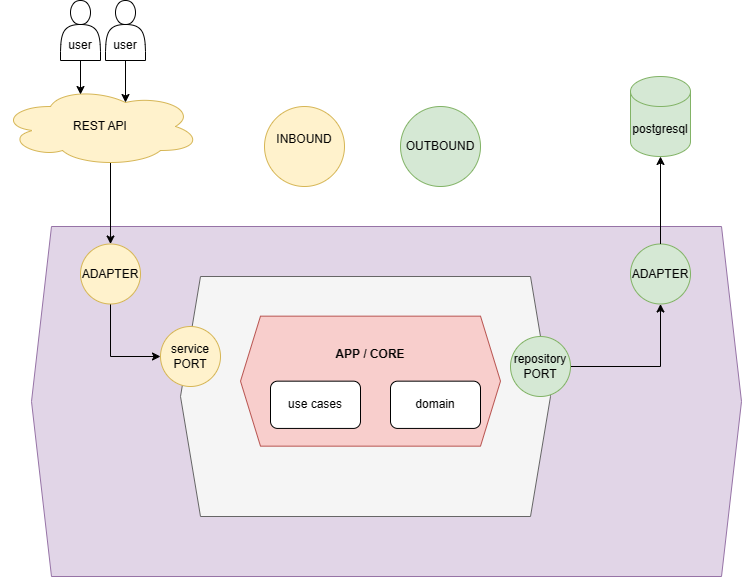
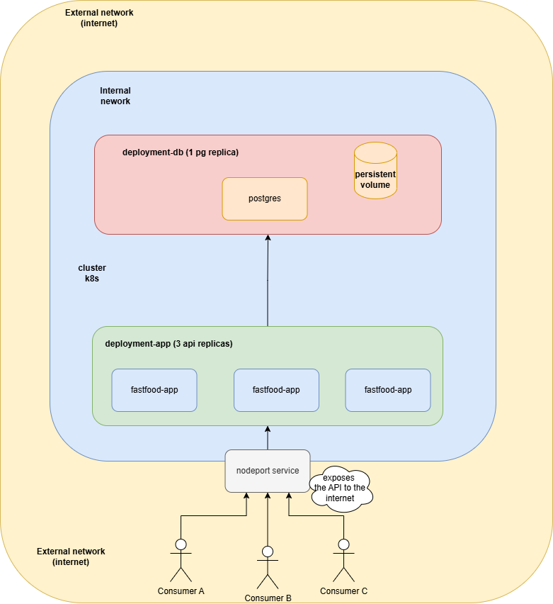
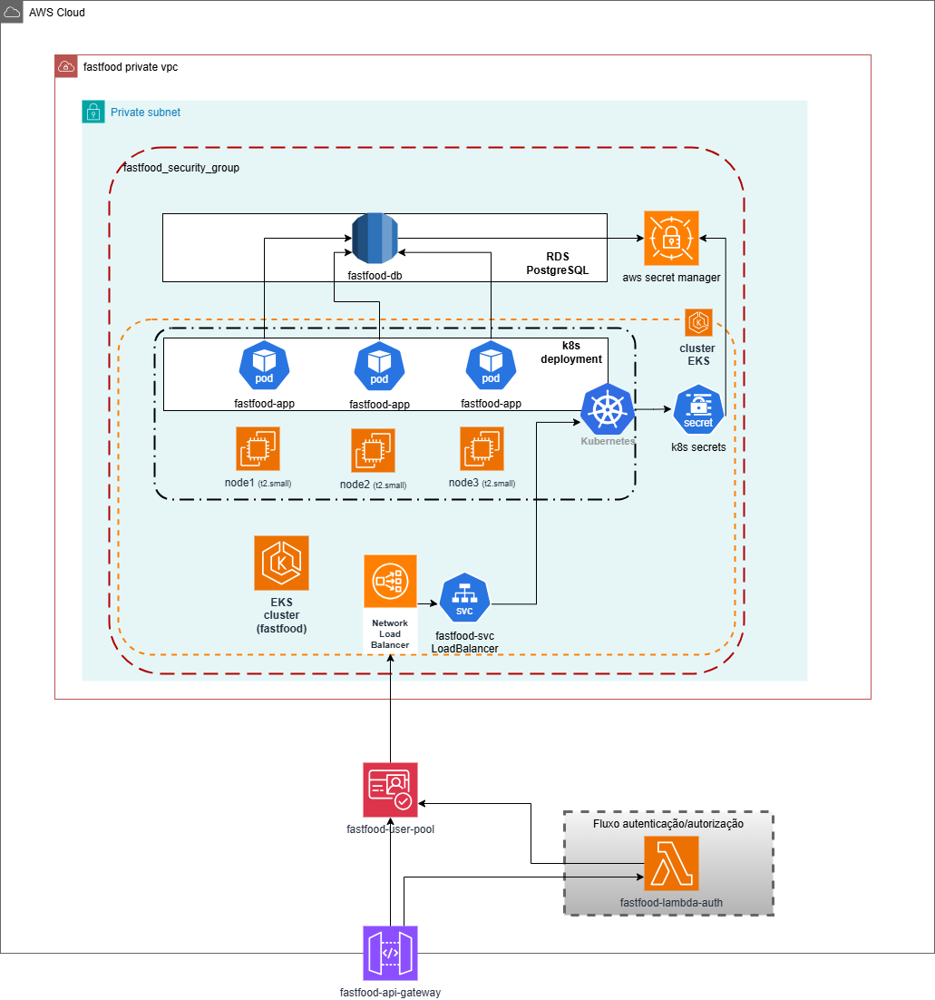

# Serviço fastfood com arquitetura hexagonal

Serviço responsável por manter produções de pedidos fastfood.

## 🏛👷 Arquitetura

O serviço foi desenvolvido utilizando o padrão de arquitetura hexagonal, onde a pasta/camada `app` é o centro da aplicação e as camadas `infra` e `adapter` são periféricas.

A camada `app` é <strong>agnóstica</strong>, ela depende só de si mesma, portanto ela não se comunica com camadas periféricas, entretanto as camadas periféricas (`infra` e `adapter`) se comunicam com ela. 
 
A camada `adapter` é responsável por fazer a ponte (comunicação) entre o `"mundo externo"` e a camada `app`, portanto para o desenvolvimento deste há dois *"adapters"*: um responsável pela saída (*"OUTBOUND"*) comunicando com o banco de dados postgresql, e outro pela entrada (*"INBOUND"*) que é responsável por expor uma API rest (recebendo requisições HTTP) para consumidores.

Abaixo uma imagem representativa:




## 👷🏃 Como construir e executar?

O desenvolvimento deste foi feito em cima da plataforma de desenvolvimento nodejs (com nestjs) e banco de dados postgresql para a persistência dos dados, portanto é recomendado as seguintes versões para a execução local:
```
node: 20.12.2
npm: 10.5.0
postgresql: 16
```

### Comando para rodar local (modo debug):
```
$ npm install 
# (O comando acima instala todas dependencias do projeto node, é necessario apenas a primeira vez e caso outra dependencia seja adicionada)

$ npm run start:dev
# (O comando acima roda o projeto no ambiente local)
```

**Nota:** para executação local, é necessario configurar um banco de dados postgresql, portanto recomenda-se o docker para facilitar este processo. O próximo passo explica como executar com docker.


### Para construir e executar com docker:

- Construção:

```$ docker compose up --build```

- Execução (depois de construído):

```$ docker compose up```

--- 

**Nota:** para consultar os recursos da API, acesse o swagger através da url http://localhost:3000/api .


## 📁 Estrutura de pastas

```.
└── src
    ├── adapter
    │   └── inbound
    │   │   └── controller/ (onde sao definidas classes responsaveis por expor a api http)
    │   └── outbound
    │   │   └── database/ (onde sao definidas classes responsaveis por realizar comunicacao com o banco de dados)
    ├── app
    │   ├── core/ (onde sao definidas classes 'domains, value objects e exceptions')
    │   ├── mapper/ (onde sao definidos classes responsaveis por transformar ports dtos em classes de dominio)
    │   └── port/ (onde sao definidas classes 'inbound/outbounds', os 'adapters' invocam estes)
    ├── infra/ (onde sao definidss classes de configuração que dão suporte para todas camadas)
    ├── util/ (onde sao definidas classes utilitarias de reuso)
    └── main.ts (classe main, responsavel por iniciar a aplicacao)

```

## 📖 Linguagem ubíqua

Termo   | Definição
------- | ------
Fastfood | Significa "comida rápida", é um tipo de alimentação que é preparada e servida de forma ágil.
Cardápio | Onde os produtos são exibidos para clientes.
Pedido | É iniciado e gerado pelo cliente com os itens solicitados.
Itens do pedido | Conjunto de produtos (onde contem nome, descrição e preço) com a respectiva quantidade solicitada que foram adicionados no pedido.
Produto | Item específico disponível para compra no cardápio.
Checkout | Etapa importante em sistemas de comércio eletrônico, onde os clientes revisam e finalizam suas compras.
Cozinha | Pessoa responsável por mover status do pedido.
Cliente | Pessoa que solicita e recebe o pedido.
Status | Se refere ao estado ou condição que o pedido se encontra.

## Kubernetes (fase 02)



## Arquitetura no cloud provider AWS (fase 03)



### Abaixo estao os respectivos repositorios que compoe/monta a ilustracao acima
- RDS - PostgreSQL (https://github.com/antoniodsaf/fastfood-db)   
- Cognito - Identity Provider (https://github.com/antoniodsaf/fastfood-cognito)
- Lambda Authorizer (https://github.com/antoniodsaf/fastfood-lambda-auth)
- Cluster EKS (https://github.com/antoniodsaf/fastfood-eks)
- API Gateway (https://github.com/antoniodsaf/fastfood-api-gateway)